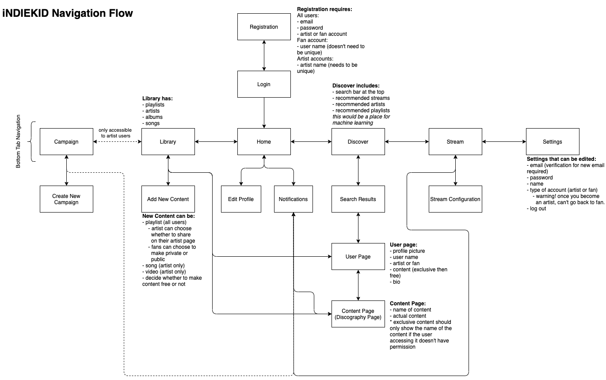

# iNDIEKID

*iNDIEKID* is a platform for independent musicians to finally have a place to manage all their various endeavors without leaving one app. It is designed to allow fans to contribute directly to their favorite musicians projects and allows musicians to be paid a more reasonable amount for their hard work and effort. To incentivize fans, musicians can provide exclusive content and streams for a predetermined amount. It also allows musicians to manage their various social media, streaming services, revenue, and other important analytics. iNDIEKID will help independent musicians become more independent without sacrificing their love for music in the self management process.

Navigation flow diagram:

**Goals:** We plan for iNDIEKID to become a community platform where independent musicians can better manage their payments, promotion, and content creation, as well as a way to seamlessly connect with their fans. It will allow fans to create playlists, follow their favorite artist, buy subscriptions, stream live shows, access exclusive content, on top of functionalities provided by modern audio streaming services.

We hope to eventually expand usership to independent record labels, add in-platform distribution, and also allow artists to collaborate over the platform.
